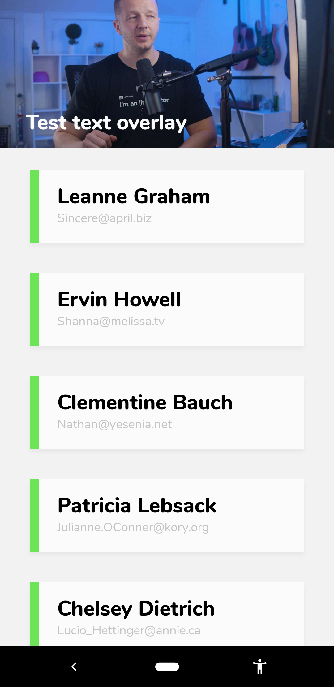

# Learning Bravo Studio

Just one of the things I'm learning. <https://github.com/hchiam/learning>

Make very real prototypes with Bravo. Turn prototypes in [Figma](https://github.com/hchiam/learning-figma) into native apps with API calls, all without coding. Bravo is currently free (for the first 3 projects). Based on this YouTube tutorial I saw: <https://www.youtube.com/watch?v=t15BZZ1giGo>

<https://www.bravostudio.app>

<https://www.figma.com>

<https://jsonplaceholder.typicode.com> (For example: <https://jsonplaceholder.typicode.com/users>)

Preview on your mobile device with Bravo Vision: <https://www.bravostudio.app/download-bravo-vision> to scan the QR code.

## Example

<https://www.figma.com/file/9BIDrSfqiWoTJtJDQzbckb/Bravo-Studio-Test?node-id=0%3A1>

## More notes

Just use Bravo tags in [Figma](https://github.com/hchiam/learning-figma) frames (for special elements and actions): <https://www.notion.so/Bravo-Tags-145bec845f0b4afaa9e3bb8321b218a8>

Open video: [`[action:openvideo:https://google.com/test.mp4 or YouTube link]`](https://www.notion.so/Bravo-Tags-145bec845f0b4afaa9e3bb8321b218a8)

Embedded video (mp4 only): [`[component:video:https://google.com/test.mp4]`](https://www.notion.so/Bravo-Tags-145bec845f0b4afaa9e3bb8321b218a8)

- For example: `Rectangle 1 [component:video:https://coursetro.s3.amazonaws.com/stuff/prev.mp4]`

Repeating list: [`*list [container]`](https://www.notion.so/Bravo-Tags-145bec845f0b4afaa9e3bb8321b218a8)

Fixed top bar: [`... [container:top-bar]`](https://www.notion.so/Bravo-Tags-145bec845f0b4afaa9e3bb8321b218a8)

<https://help.figma.com/hc/en-us/articles/360040314193>

<https://www.notion.so/Bravo-Help-Center-0c15a9e512484895853da68fde6d23df>
